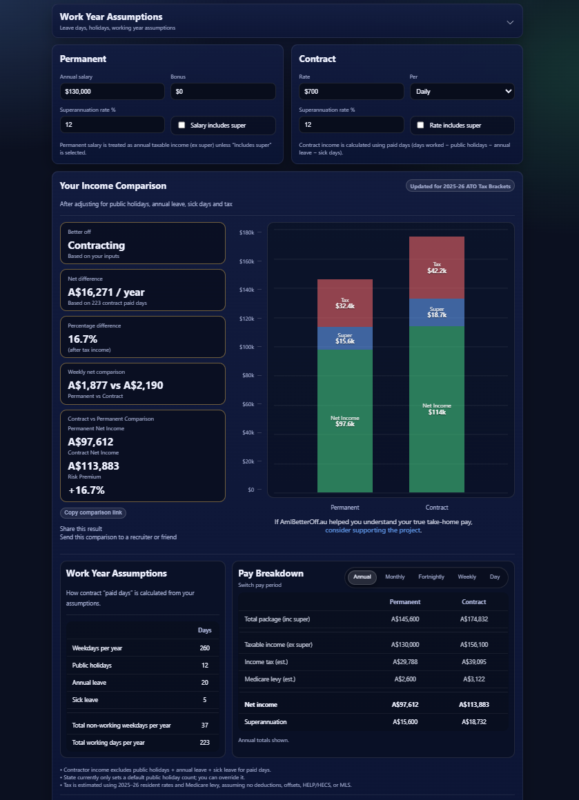

# AmIBetterOff.au Developer Notes

**Public build log for [AmIBetterOff.au](https://amibetteroff.au)**
A contractor vs. permanent salary calculator for the Australian market.

🦆 First Portfolio / Live Production Project

🛠️ Project Stats: 400+ hours of development | 🚀 Hosted on Cloudflare | 🇦🇺 Built for Aussie Professionals.

  

> *Current production UI of AmIBetterOff.au*

### Stack
- HTML / CSS / JavaScript
- Cloudflare Workers
- Cloudflare Analytics
- Stripe Payment Links
- Google Search Console
- GitHub Actions

### May 2026 Snapshot 
- ~2.5k unique visitors
- 286 Google Search clicks
- ~7.66k search ompressions
- Average Google position: 6.7

## Developer Notes

### ⛰️ The Journey
* [The Why](./posts/the_why.md) — Why I built this calculator.
* [Build Zero](./posts/build_0.md) — Spreadsheeting core logic.
* ~~[Using AI]~~ — Building a flawed MVP.
* [Tooling](./posts/tooling.md) — My development setup.
* [UI/UX Design](./posts/ui_ux.md) — Designing a clean, intuitive UI/UX.
* ~~[Building a brand]~~ — Picking a name and registering a domain.

### 🛠️ Technical Decisions
* [Infrastructure Design](./posts/infra_design.md) — Architecture choices for speed and low cost.
* ~~[Cloudflare Deployment]~~ — Configuration and edge hosting.

### 📈 Marketing & Legal
* ~~[SEO Lessons]~~ — Ranking for Australian salary terms.
* ~~[Open Graph]~~ — Building for engagement and sharing.
* [Compliance & Liability](./posts/compliance.md) — Handling financial calculation disclaimers.

### 🚀 Launch
* [Launch & Feedback](./posts/launch.md) — Driving organic search growth through Reddit.
* ~~[Future Features]~~ — Planned Features & Fixes.
* ~~[Deployment mistakes]~~ — Enforcing Https.

### 📋 Current Site Metrics
* [Site Performance](./posts/performance.md) — Google Search Console & Cloudflare Analytics.
* ~~[Site Analytics]~~ — A plan to further implement site interaction analytics. 
